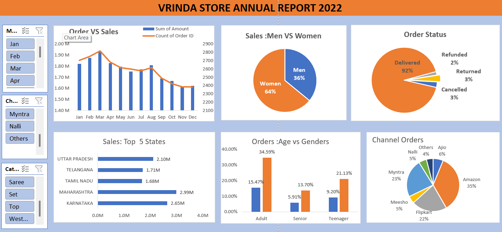

# Vrinda Store Data Analysis (Interactive Dashboard using MS Excel)

---

## **Project Objective**

The Vrinda Store wants to create an annual sales report for **2022** so that the owner can better understand their customers and grow sales in **2023**.

---

## **Dataset Used**

- **Name:** Vrinda Store Data  
- **File:** [Vrinda_store_data_analysis_report.xlsx](./Vrinda_store_data_analysis_report.xlsx)  

---

## **Key Performance Indicators (KPIs)**  

- Compare the sales and orders using a single chart.  
- Which month got the highest sales and orders?  
- Who purchased more — Men or Women?  
- What are the different order statuses in **2022**?  
- List the **Top 10 States** contributing to the sales.  
- Find the relation between **Age** and **Gender** based on the number of orders.  
- Which channel contributed the maximum to the sales?  
- What is the highest selling category?  

---

## **Process Followed**

- Verified data for missing values and anomalies and corrected them.  
- Ensured consistency in data types, formats, and values.  
- Created **Pivot Tables** to answer the KPIs listed.  
- Merged all pivot tables into one dashboard and applied slicers to make it interactive and dynamic.  

---

## **Dashboard**  

The interactive dashboard gives a visual summary of the KPIs.  
**[Vrinda_store_report.png](./Vrinda_store_report.png)**  

---

## **Project Insights**

- **Women customers** (~65%) are more likely to buy products compared to men.  
- The top **3 product buying states** are **Maharashtra**, **Karnataka**, and **Uttar Pradesh**.  
- The **adult age group (30–49 years)** contributes to ~50% of total purchases.  
- The majority of customer orders come from **Amazon**, **Flipkart**, and **Myntra** sales channels.  

---

## **Final Conclusion**

To improve sales of **Vrinda Store**, the business should focus on:  
- Targeting **women customers** in the **30–49 years** age group.  
- Focusing on customers from **Maharashtra**, **Karnataka**, and **Uttar Pradesh**.  
- Promoting offers and ads through **Amazon**, **Flipkart**, and **Myntra** to reach the largest customer base.  

---
